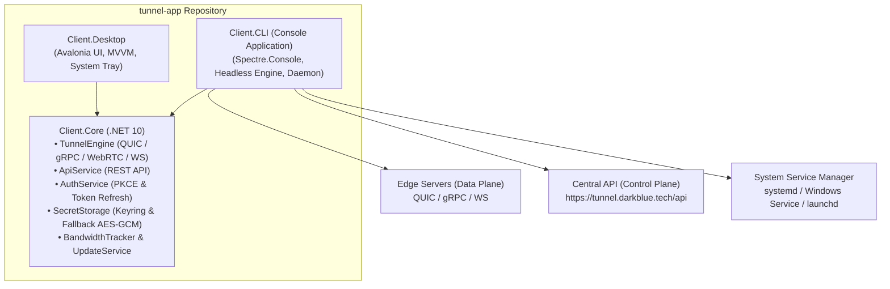

# ROADMAP — DarkTunnel Client.CLI

**Цель:** Создание высокопроизводительного, автономного кроссплатформенного CLI-клиента (`darktunnel`) для управления обратными туннелями `tunnel.darkblue.tech`. Клиент предназначен для работы на серверах, IoT-устройствах, локальных машинах разработчиков и в CI/CD пайплайнах, предоставляя как быстрый ad-hoc проброс портов, так и декларативное мульти-туннелирование и работу в режиме системного демона (systemd/service).

**Целевые платформы:**
- **Linux:** x64, ARM64 (Ubuntu/Debian, RHEL/Fedora, Alpine, Arch)
- **Windows:** 10/11, Server (x64, ARM64)
- **macOS:** 12+ (Apple Silicon arm64, Intel x64)
- **FreeBSD / Headless BSD:** (x64 — благодаря отсутствию GUI-зависимостей Avalonia)
- **Docker:** Легковесный контейнер для контейнеризированных окружений

**Технологический стек:**
- **Язык/Платформа:** C# / .NET 10 (C# 13)
- **Базовое ядро:** `Client.Core` (повторное использование `TunnelEngine`, `ApiService`, `AuthService`, `SecretStorage`, `BandwidthTracker`, `UpdateService`)
- **CLI/TUI Фреймворк:** `Spectre.Console` + `Spectre.Console.Cli` (ANSI-стилизация, Live Dashboard, спиннеры, интерактивные prompt-ы)
- **Конфигурация:** YAML (`YamlDotNet`) + JSON (`System.Text.Json`)
- **Сборка/Дистрибуция:** Self-contained Single-File executables (`PublishSingleFile=true`, `IncludeNativeLibrariesForSelfExtract=true`)

---

## 1. Архитектурная концепция и связь с Client.Core

Проект `Client.CLI` создается внутри репозитория `tunnel-app` по пути `desktop/Client.CLI` и подключает `Client.Core` через прямой `ProjectReference`. Это исключает дублирование сетевой и бизнес-логики и гарантирует мгновенную синхронизацию протоколов между Desktop и CLI.



### Разделение ответственности и доработки в `Client.Core`:
1. **Повторное использование без изменений:**
   - `TunnelEngine`: мультиплексирование потоков, управление жизненным циклом соединений, экспоненциальный backoff, heartbeat (ping/pong).
   - `ApiService`: получение списка зарегистрированных туннелей пользователя и поиск оптимальной Edge-ноды (`/v1/edge-nodes/preferred`).
   - `BandwidthTracker`: подсчет входящего (Rx) и исходящего (Tx) трафика в реальном времени.
   - `SecretStorage`: безопасное хранилище токенов (DPAPI на Windows, Secret Service на Linux, Keychain на macOS, AES-256-GCM fallback на headless-серверах).
2. **Расширение `Client.Core` для поддержки CLI:**
   - **Loopback OAuth Callback:** Добавление встроенного эфемерного HTTP-сервера (`http://127.0.0.1:<port>/callback`) для автоматического перехвата OAuth-кода при входе через браузер на десктопных терминалах.
   - **Токенная авторизация (PAT / Service Tokens):** Поддержка прямой передачи токена без вызова браузера (`--token <jwt>`, переменная `DARKTUNNEL_TOKEN`).
   - **Headless-совместимость событий:** Предоставление структурированных событий статуса (без привязки к Avalonia Dispatcher).

---

## 2. Командная строка и UX-дизайн (Spectre.Console)

### 2.1. Дерево команд

```text
darktunnel [command] [options]

Команды быстрого старта (Ad-hoc):
  http <port>                Быстрый запуск HTTP-туннеля на указанный локальный порт
  tcp <port>                 Быстрый запуск произвольного TCP-туннеля

Команды управления туннелями (Managed):
  list, ls                   Список туннелей, привязанных к учетной записи в веб-панели
  start <id|name>            Запуск туннеля из веб-панели по его ID или имени
  start --all                Одновременный запуск всех включенных в профиле туннелей
  run --config <file>        Декларативный запуск туннелей по локальному YAML-файлу

Команды аутентификации и профиля:
  login                      Авторизация (интерактивная через браузер или по токену)
    --token <token>          Вход по явно переданному Personal Access Token / JWT
    --manual                 Вывести URL для входа и запросить ручной ввод кода авторизации
  logout                     Завершение сессии и очистка локальных учетных данных
  whoami                     Информация о текущем пользователе и активной сессии

Команды конфигурации:
  config init                Создание шаблона darktunnel.yaml в текущей директории
  config view                Просмотр текущей эффективной конфигурации
  config set <key> <val>     Установка параметров (default-transport, edge-url, log-level)

Управление системной службой (Daemon / Service):
  service install            Установка darktunnel в качестве системного сервиса (systemd/Windows Service)
  service uninstall          Удаление системного сервиса
  service start              Запуск фоновой службы
  service stop               Остановка фоновой службы
  service status             Проверка статуса фоновой службы

Служебные команды:
  status                     Текущий статус туннелей и сетевых соединений
  update                     Проверка и применение обновлений бинарного файла
  version, --version         Вывод версии клиента и информации о сборке
```

### 2.2. Терминальный интерфейс в реальном времени (Live Dashboard)

При запуске туннеля в интерактивном режиме в терминале разворачивается динамический дашборд на базе `Spectre.Console.LiveDisplay`:

```text
╭─────────────────────────────────────────────────────────────────────────────╮
│  DarkTunnel CLI v1.0.2 [Connected via QUIC]                                 │
│  Session: artem@darkblue.tech | Region: EU-Frankfurt (18 ms)                │
╰─────────────────────────────────────────────────────────────────────────────╯

  STATUS         TUNNEL NAME    PUBLIC URL                             LOCAL TARGET     CONNS   SPEED (RX/TX)
  ● ONLINE       web-dev        https://web-dev.tunnel.darkblue.tech   127.0.0.1:8080   3       124.5 KB/s / 42.1 KB/s
  ● ONLINE       api-service    http://tunnel.darkblue.tech:7022       127.0.0.1:3000   1       12.0 KB/s / 8.4 KB/s

╭─ Recent Activity ───────────────────────────────────────────────────────────╮
│ [14:22:01] GET  /api/v1/health -> 200 OK (14ms)                             │
│ [14:22:05] POST /api/v1/checkout -> 201 Created (68ms)                       │
│ [14:22:12] Accepted public connection -> stream 8f9b1c2d                    │
╰─────────────────────────────────────────────────────────────────────────────╯
  Press Ctrl+C to terminate session | Press 'L' to view live log stream
```

Для скриптов, пайплайнов и CI/CD предусмотрен флаг `--no-tui` (или автодетекция отсутствия TTY): в этом случае клиент выводит стандартный лог в `stdout` или NDJSON (при флаге `--json`).

---

## 3. Спецификация конфигурационного файла (`darktunnel.yaml`)

Клиент поддерживает как глобальный конфиг (`~/.config/darktunnel/config.yaml` / `%APPDATA%\darkblue.tech\Tunnel\config.yaml`), так и локальный проектный `darktunnel.yaml`:

```yaml
version: "1.0"

# Глобальные параметры подключения
api_url: "https://tunnel.darkblue.tech/api"
preferred_region: "auto"        # auto, eu, us, asia
transport: "auto"               # auto, quic, grpc, webrtc, websocket
log_level: "info"               # debug, info, warn, error

# Токен авторизации (опционально; приоритет отдается переменной DARKTUNNEL_TOKEN)
# token: "eyJhbGciOi..."

# Описание туннелей для запуска командой `darktunnel run`
tunnels:
  frontend:
    proto: http
    local_target: "127.0.0.1:3000"
    subdomain: "my-frontend"
    inspect: true

  backend:
    proto: http
    local_target: "localhost:8080"
    subdomain: "my-api"
    transport: quic

  database:
    proto: tcp
    local_target: "127.0.0.1:5432"
    public_port: 7054
```

---

## 4. Фазы реализации

### Фаза 1 — Каркас проекта, Базовый CLI и Ad-hoc туннели (MVP)
*Срок: 1–2 недели*
*Фокус: Создание исполняемого консольного приложения, базовый CLI-роутинг и запуск одного туннеля.*

- **1.1. Инициализация проекта:**
  - Создание `desktop/Client.CLI/Client.CLI.csproj` (.NET 10).
  - Подключение `ProjectReference` на `Client.Core`.
  - Подключение пакетов: `Spectre.Console`, `Spectre.Console.Cli`, `YamlDotNet`.
  - Добавление `Client.CLI` в корневые сборки и Makefile.
- **1.2. Базовые команды и парсинг:**
  - Настройка `CommandApp` с автогенерацией справки (`--help`).
  - Команды `version`, `whoami`.
- **1.3. Аутентификация:**
  - Чтение существующей авторизации из `SecretStorage` (автологин, если Desktop уже авторизован).
  - Команда `login --token <jwt>` для прямого сохранения токена.
  - Поддержка переменной окружения `DARKTUNNEL_TOKEN`.
  - Интерактивный `login` с открытием браузера и ручным вводом кода (fallback).
  - Команда `logout`.
- **1.4. Ad-hoc запуск туннеля:**
  - Команда `darktunnel http <port>` (например, `darktunnel http 8080`).
  - Команда `darktunnel tcp <port>` (например, `darktunnel tcp 22`).
  - Флаги: `--subdomain`, `--transport`, `--public-port`.
  - Базовый консольный вывод статуса подключения и полученного публичного URL.
  - Корректная обработка `Ctrl+C` (graceful shutdown сессии).

---

### Фаза 2 — Управляемые туннели и Декларативная конфигурация
*Срок: 2 недели*
*Фокус: Полная интеграция с веб-панелью (Pull-модель) и запуск по YAML-конфигу.*

- **2.1. Интеграция с API веб-панели:**
  - Команда `darktunnel list` (или `ls`): форматированная таблица `Spectre.Console.Table` с отображением всех туннелей аккаунта, их статусов, доменов и локальных портов.
  - Команда `darktunnel start <id|name>`: запуск туннеля по имени или ID из серверного профиля.
  - Команда `darktunnel start --all`: одновременный параллельный запуск всех сохраненных туннелей пользователя в рамках одного CLI-процесса.
- **2.2. Декларативная конфигурация (YAML):**
  - Реализация загрузчика `ConfigurationManager` для поиска и валидации `darktunnel.yaml` и `~/.config/darktunnel/config.yaml`.
  - Команда `darktunnel run [--config path]`: поднятие группы туннелей, описанных в YAML.
  - Команды `config init` (генерация примера конфига), `config view`, `config set`.
- **2.3. Доработка OAuth Loopback в CLI:**
  - Поднятие локального `HttpListener` на случайном порту `127.0.0.1` при выполнении `darktunnel login`.
  - Автоматический перехват редиректа без необходимости вручную копировать токены.

---

### Фаза 3 — Продвинутый UX, Наблюдаемость и Live TUI
*Срок: 1–2 недели*
*Фокус: Красивый интерактивный дашборд, метрики и удобство для разработчиков.*

- **3.1. Live Dashboard (TUI):**
  - Реализация полноэкранного / секционного `LiveDisplay` в стиле ngrok:
    - Сведения о сессии (пользователь, выбранный Edge-сервер, задержка RTT).
    - Таблица активных туннелей с динамическим счетчиком соединений.
    - Показатели скорости передачи (Rx / Tx) на базе `BandwidthTracker`.
- **3.2. Логирование и скриптинг:**
  - Автоопределение TTY (`Console.IsOutputRedirected`).
  - Флаг `--no-tui` / `--quiet` для использования в пайплайнах.
  - Флаг `--json` для машиночитаемого вывода событий и статусов в stdout.
  - Интерактивный переключатель подробных логов по горячим клавишам (`L`).

---

### Фаза 4 — Режим системного демона (Background Service / Daemon)
*Срок: 2 недели*
*Фокус: Надежная автономная работа на серверах и автозапуск вместе с ОС.*

- **4.1. Архитектура фонового процесса:**
  - Поддержка `Microsoft.Extensions.Hosting.WindowsServices` и `Microsoft.Extensions.Hosting.Systemd`.
  - Разделение команд управления и исполнения службы:
    - `darktunnel service run --config /etc/darktunnel/config.yaml` — точка входа сервиса.
- **4.2. Инсталляторы службы:**
  - **Linux (systemd):** `darktunnel service install` создает unit-файл `/etc/systemd/system/darktunnel.service` с политикой перезапуска `Restart=always` и правами ограниченного пользователя.
  - **Windows:** Регистрация службы Windows через `sc.exe` / Windows Service API.
  - **macOS:** Генерация `launchd` plist-манифеста в `~/Library/LaunchAgents`.
- **4.3. Управление жизненным циклом службы:**
  - Команды `service start`, `service stop`, `service restart`, `service status`.

---

### Фаза 5 — Дистрибуция, Упаковка и CI/CD
*Срок: 1–2 недели*
*Фокус: Доставка клиентам, однострочные скрипты установки и автоматические релизы.*

- **5.1. Multi-platform сборка:**
  - Конфигурация компиляции Self-contained Single-File:
    - `linux-x64`, `linux-arm64`
    - `win-x64`, `win-arm64`
    - `osx-x64`, `osx-arm64`
    - `freebsd-x64` (таргет без GUI, использующий fallback-транспорты gRPC/WebSocket при отсутствии MsQuic)
- **5.2. Скрипты быстрой установки:**
  - Linux/macOS: `curl -fsSL https://tunnel.darkblue.tech/install.sh | sh` (определение архитектуры, загрузка бинарника из GitHub Releases в `/usr/local/bin/darktunnel`).
  - Windows: `irm https://tunnel.darkblue.tech/install.ps1 | iex`.
- **5.3. Docker-образ:**
  - Минималистичный Dockerfile на базе `alpine` или `distroless` (`mcr.microsoft.com/dotnet/runtime-deps:10.0-alpine`).
  - Публикация в GHCR: `ghcr.io/darkblue-tech/darktunnel-cli:latest`.
- **5.4. Встроенное обновление (`darktunnel update`):**
  - Интеграция `UpdateService` для проверки новых тегов GitHub Releases и автоматической замены бинарника "на лету".
- **5.5. Интеграция в GitHub Actions:**
  - Дополнение существующего пайплайна `.github/workflows/release.yml` шагами компиляции и прикрепления архивов CLI (`darktunnel-cli-<os>-<arch>.tar.gz` / `.zip`) к релизам.

---

## 5. Безопасность и хранение учетных данных

1. **Многоуровневое хранилище секретов:**
   - Рабочие станции: нативное шифрование ОС (Windows Credential Manager / DPAPI, macOS Keychain, Linux Secret Service через D-Bus).
   - Headless-серверы / SSH-сессии: автоматический fallback на `FallbackSecretStorageProvider` с использованием AES-256-GCM, энтропии машины и жестких прав Unix (`0700` на директорию и `0600` на файл ключа).
2. **Безопасность в CI/CD и контейнерах:**
   - Приоритет переменной окружения `DARKTUNNEL_TOKEN` исключает необходимость сохранять секреты на диск в контейнерах.
3. **Безопасность передачи данных:**
   - Обязательный TLS 1.3 для всех транспортов (QUIC, gRPC, WebSocket).
   - Защита от компрометации control channel через валидацию server JWT и проверку сертификатов.

---

## 6. Матрица рисков и способы их смягчения

| Риск | Влияние | Стратегия смягчения |
| --- | --- | --- |
| **Отсутствие GUI-окружения для браузерного OAuth** | Высокое | Гибридная аутентификация: флаг `--token`, переменная `DARKTUNNEL_TOKEN`, вывод URL со ссылкой и ручной ввод кода в консоль (`--manual`). |
| **Размер Single-File бинарника** | Среднее | Использование Trimming и сжатия (`PublishTrimmed=false` для надежности gRPC/SIPSorcery, но с оптимизацией символов и исключений; ориентир: 25–35 МБ для полностью self-contained файла). |
| **Разрыв соединения на ненадежных серверах** | Высокое | Встроенный в `TunnelEngine` непрерывный reconnect-цикл с экспоненциальным backoff (до 30 сек) и отправкой Keep-Alive ping-сообщений каждые 20 сек. |
| **Работа в контейнерах без прав root** | Среднее | Поддержка кастомного пути к конфигурации через `--config` или `XDG_CONFIG_HOME`, не требующая прав суперпользователя. |
| **Специфика MsQuic на редких дистрибутивах Linux / FreeBSD** | Среднее | Автоматическая цепочка fallback в `TunnelEngine`: `QUIC -> WebRTC -> gRPC -> WebSocket`. При отсутствии `libmsquic` туннель стабильно работает через gRPC/HTTP2. |

---

## 7. Чек-лист готовности к релизу v1.0 CLI

- [ ] Создан проект `desktop/Client.CLI` с таргетом `net10.0`.
- [ ] Реализованы команды `http`, `tcp`, `list`, `start`, `run`, `login`, `logout`, `whoami`.
- [ ] Реализован Live TUI Dashboard на Spectre.Console.
- [ ] Обеспечена поддержка `darktunnel.yaml` и переменной `DARKTUNNEL_TOKEN`.
- [ ] Реализована поддержка системных демонов (systemd / Windows Service).
- [ ] Настроена кроссплатформенная матрица сборки в `.github/workflows/release.yml`.
- [ ] Подготовлены скрипты быстрой установки `install.sh` и `install.ps1`.
- [ ] Опубликован Dockerfile для `darktunnel-cli`.
